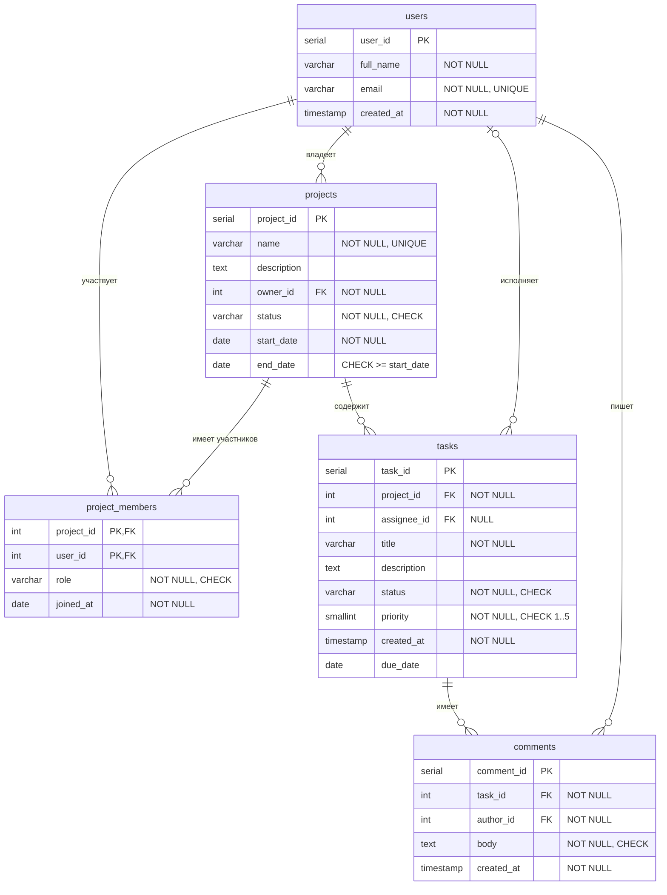

# Лабораторная работа №1. Вариант 11 — Система управления проектами

## Состав работы

| Файл | Содержимое |
|---|---|
| `schema.sql` | создание структуры БД (5 таблиц, ключи, ограничения) |
| `data.sql` | тестовые данные |
| `constraints_test.sql` | 12 некорректных INSERT/UPDATE/DELETE + демонстрация ON DELETE |
| `migration.sql` | изменение структуры по дополнительному требованию (ALTER TABLE) |
| `cheatsheet.md` | шпаргалка к защите |

Порядок запуска:

```bash
createdb project_db
psql -d project_db -f schema.sql
psql -d project_db -f data.sql
psql -d project_db -f constraints_test.sql
psql -d project_db -f migration.sql
```

## 1. Описание предметной области

Система помогает команде вести проекты. В системе есть **пользователи** (сотрудники).
Пользователь может создать **проект** и стать его владельцем. В проект добавляются
**участники** с определённой ролью (менеджер, разработчик, тестировщик, аналитик); один
человек может участвовать в нескольких проектах. Работа в проекте разбивается на **задачи**:
у задачи есть статус, приоритет (1 — самый высокий, 5 — самый низкий), срок и исполнитель.
К задачам пользователи оставляют **комментарии**.

## 2. Сущности и связи

| Таблица | Назначение | Основные атрибуты |
|---|---|---|
| `users` | пользователи | ФИО, email, дата регистрации |
| `projects` | проекты | название, описание, владелец, статус, даты начала/окончания |
| `project_members` | участие пользователя в проекте | проект, пользователь, роль, дата вступления |
| `tasks` | задачи проекта | проект, исполнитель, название, статус, приоритет, срок |
| `comments` | комментарии к задачам | задача, автор, текст, дата |

Связи:

- `users` 1 — N `projects` (владелец проекта);
- `users` M — N `projects` через `project_members` (участники);
- `projects` 1 — N `tasks`;
- `users` 1 — N `tasks` (исполнитель, необязательная связь);
- `tasks` 1 — N `comments`;
- `users` 1 — N `comments` (автор).

## 3. ER-диаграмма



> Диаграмма в формате Mermaid — отображается на GitHub и в VS Code (расширение
> «Markdown Preview Mermaid Support»). Можно также построить её в pgAdmin:
> правый клик по БД → *ERD For Database*.

## 4. Основные проектные решения

**Ключи.** У каждой сущности суррогатный ключ `SERIAL` (автоинкремент) — он короткий,
не меняется и удобен для внешних ключей. Исключение — `project_members`: это таблица
связи M:N, её ключ составной `(project_id, user_id)`, он же запрещает добавить человека в
проект дважды.

**Типы данных.**
- `VARCHAR(n)` — для коротких строк с понятной максимальной длиной (имя, email, статус);
- `TEXT` — для длинных текстов без ограничения (описание, комментарий);
- `DATE` — для дат без времени (сроки), `TIMESTAMP` — для момента создания записи;
- `SMALLINT` — для приоритета (значения 1–5, хватает 2 байт).

**Ограничения.**

| Вид | Где |
|---|---|
| `NOT NULL` | все обязательные поля (имя, email, название, статус, внешние ключи владельца/проекта/автора…) |
| `UNIQUE` | `users.email`, `projects.name`, `tasks (project_id, title)` — составное |
| `CHECK` | формат email; список статусов проекта; `end_date >= start_date` — составное; список ролей; список статусов задачи; приоритет 1–5; непустой комментарий |
| `PRIMARY KEY` составной | `project_members (project_id, user_id)` |
| `DEFAULT` | статус, приоритет, роль, даты создания |

**Правила ON DELETE.**

| Внешний ключ | Правило | Почему |
|---|---|---|
| `projects.owner_id → users` | `RESTRICT` | нельзя удалить пользователя, пока он владеет проектом: сначала проект передают другому — проект не должен остаться без ответственного |
| `project_members.project_id → projects` | `CASCADE` | нет проекта — нет и участия в нём |
| `project_members.user_id → users` | `CASCADE` | удалили пользователя — он больше нигде не участвует |
| `tasks.project_id → projects` | `CASCADE` | задачи не существуют без проекта |
| `tasks.assignee_id → users` | `SET NULL` | задача остаётся, но становится неназначенной — её можно передать другому |
| `comments.task_id → tasks` | `CASCADE` | комментарии бессмысленны без задачи |
| `comments.author_id → users` | `RESTRICT` | история обсуждения важна, нельзя молча удалить автора |

**Статусы через CHECK, а не отдельную таблицу.** Список статусов маленький и меняется
редко, поэтому достаточно `CHECK (status IN (...))`. Если понадобится хранить у статуса
дополнительные данные (цвет, порядок), его выносят в справочник — см. шпаргалку.

## 5. Обоснование 3НФ

**1НФ** — все значения атомарны: нет списков в одной ячейке (участники проекта вынесены в
отдельную таблицу `project_members`, а не перечислены через запятую в `projects`), нет
повторяющихся групп столбцов, у каждой таблицы есть первичный ключ.

**2НФ** — каждый неключевой атрибут зависит от *всего* первичного ключа. Единственный
составной ключ — `(project_id, user_id)` в `project_members`; атрибуты `role` и `joined_at`
зависят от пары «проект + пользователь» (роль у человека своя в каждом проекте), а не от
одной её части. ФИО пользователя или название проекта там не хранятся. В остальных таблицах
ключ простой, поэтому 2НФ выполняется автоматически.

**3НФ** — нет транзитивных зависимостей (неключевой атрибут не зависит от другого
неключевого). Например:
- в `tasks` не хранится название проекта или ФИО исполнителя — только `project_id` и
  `assignee_id`; иначе было бы `task_id → project_id → project_name`;
- в `comments` хранится только `author_id`, а не email автора;
- в `projects` хранится только `owner_id`, а не данные владельца.

Все неключевые атрибуты каждой таблицы описывают только сущность, задаваемую её ключом.
